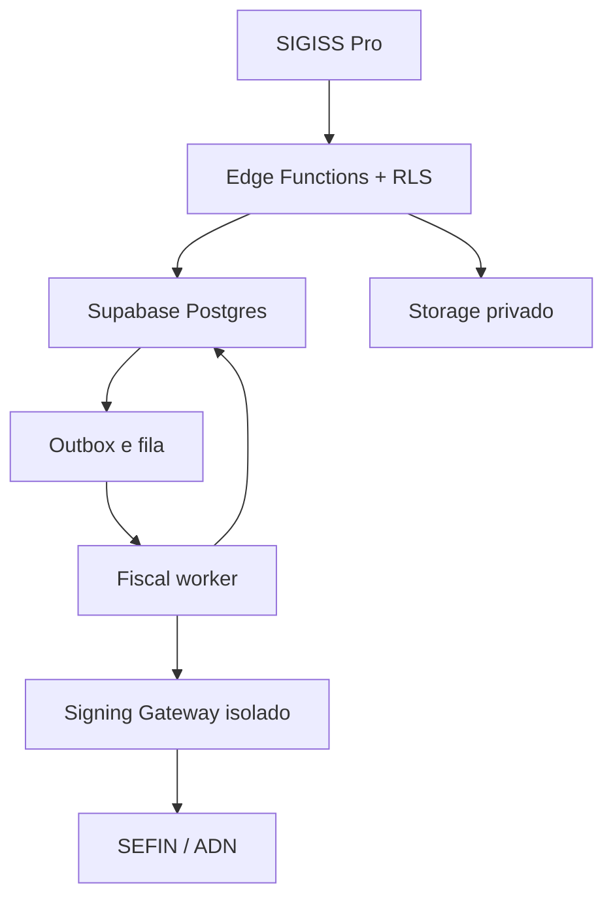

# SIGISS Pro — backend NFS-e Nacional

Backend multitenant para emissão e gestão de NFS-e pelo padrão nacional. O Supabase é o sistema de registro para identidade, empresas, documentos, auditoria, cobrança e visão 360. Assinatura XML e autenticação mTLS usam um `Signing Gateway` isolado; o projeto nunca armazena PFX, chave privada ou senha no Postgres/Storage.

## Estado real

- Arquitetura e guardrails: definidos.
- SQL de fundação, RLS, Storage e views: implementado e verificado estaticamente.
- Edge Functions e testes determinísticos: implementados; 17 unidades SQL, 70 tabelas, 13 entrypoints Edge, 31 módulos TypeScript e 24 casos unitários passam localmente.
- Projeto Supabase de homologação `xfzymoigffkfqmkzfuhq`: 17 migrações aplicadas e 10 funções ativas em `sa-east-1`; três rotas externas aguardam aprovação explícita dos provedores.
- Integração SEFIN/ADN real: bloqueada até credenciais, certificado de homologação e PoC de mTLS + XMLDSig.
- Front-end: fora deste pacote.

Nenhuma integração fiscal é considerada aprovada apenas por existir código. O gate exige execução no ambiente oficial de produção restrita e reconciliação dos documentos.

## Arquitetura



Detalhes: `docs/architecture.md`, `docs/security-and-lgpd.md`, `docs/api-contracts.md`, `docs/deployment.md` e `docs/qa-plan.md`.

Evidência hospedada: `qa/remote-validation-2026-08-02.md`.

## Regras inegociáveis

1. `tenant_id` em todas as entidades do cliente e FKs compostas para impedir vínculo entre tenants.
2. RLS em todas as tabelas expostas; autorização nunca depende de `user_metadata`.
3. Mutação fiscal somente pelo backend; navegador não grava NFS-e, evento, certificado ou auditoria.
4. Mesma idempotency key + payload diferente resulta em conflito.
5. Timeout após possível transmissão vira `unknown`; consultar a DPS antes de retransmitir.
6. PFX, senha e chave privada nunca passam pelo Supabase.
7. XML/DANFSE ficam em buckets privados, versionados, com hash e sem URL permanente.
8. Inadimplência pode impedir nova emissão, mas não consulta/exportação dos documentos existentes.
9. Empresa e perfil tributário só ficam ativos depois de aceite dos documentos vigentes e verificação externa vinculada à sessão AAL2.
10. Cada worker processa um único efeito remoto por lease; geração de fencing e idempotência acompanham a chamada ao gateway.

## Verificação local

Requer Node.js 24+:

```bash
npm run verify
```

Os testes locais comprovam invariantes determinísticos e verificações estáticas. Eles não aprovam a integração nacional.

O arquivo `qa/build-manifest.json`, gerado no fim da verificação, contém SHA-256 de cada arquivo-fonte incluído nesta versão. O ledger `qa/test-ledger.json` mantém o gate estrito de produção bloqueado enquanto faltarem evidências externas.

## Implantação

1. Criar projetos separados de desenvolvimento/homologação e produção.
2. Aplicar os arquivos de `supabase/sql` como migrações versionadas no projeto-alvo.
3. Executar os advisors de segurança e performance.
4. Implantar Edge Functions com dependências pinadas.
5. Usar as chaves gerenciadas que o Supabase injeta e configurar apenas os secrets customizados e o Signing Gateway fora do frontend.
6. Executar a matriz de RLS e os testes de produção restrita.
7. Somente então iniciar piloto com dados sintéticos e poucos CNPJs autorizados.
