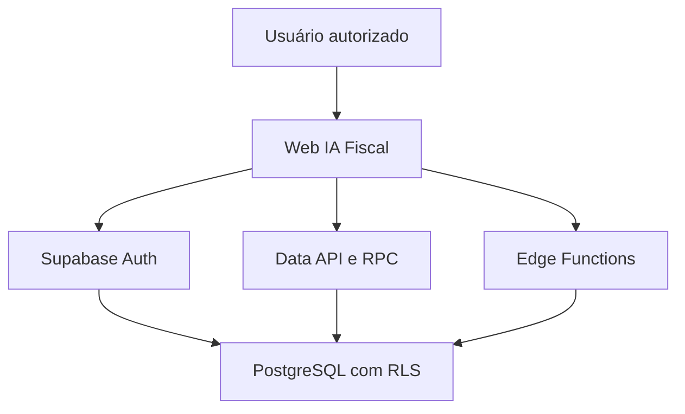

# Arquitetura — IA Fiscal

Status: homologação/sandbox
Tenant de referência: Cordeirópolis/SP (`3512407`)
Última consolidação: 2 de agosto de 2026

## Objetivo e limites

O IA Fiscal apoia a equipe municipal na identificação, análise e tratamento de divergências tributárias. Ele organiza evidências e cálculos; não substitui a competência legal da autoridade fiscal. O produto não é ERP, emissor de NFS-e, CRM ou plataforma de cobrança.

## Contexto de execução

O cliente recebe somente URL e chave publicável. Sessão e JWT identificam o usuário; RLS e funções do banco aplicam a autorização no limite de dados. As Edge Functions também exigem JWT e operam em sandbox, sem entrega externa habilitada.

## Componentes

| Componente           | Responsabilidade                                  | Restrição principal                                                |
| -------------------- | ------------------------------------------------- | ------------------------------------------------------------------ |
| TanStack Start/React | navegação, autenticação e visualização            | não contém segredo nem autoridade fiscal                           |
| `AuthContext`        | sessão e resolução do contexto de acesso          | usuário autenticado ainda precisa de membership/vínculo válido     |
| serviço fiscal web   | leitura dos contratos e chamada de RPC/Edge       | modo demo não grava; falhas não podem cair silenciosamente em mock |
| PostgreSQL           | verdade transacional, regras determinísticas, RLS | promoção depende de baseline reproduzível e auditoria dos RPCs     |
| `ia-fiscal-search`   | pesquisa fiscal autenticada                       | resposta deve preservar escopo do usuário e rastreabilidade        |
| `ia-fiscal-worker`   | fila e processamento assíncrono                   | IO externo desabilitado; sem decisão jurídica autônoma             |
| camada de IA         | interpretação e rascunho                          | conteúdo novo exige revisão fiscal; nenhum envio automático        |

## Perfis e isolamento

Papéis previstos:

- `fiscal_staff`: acesso operacional limitado ao município e às atribuições do usuário;
- `taxpayer`: acesso aos contribuintes explicitamente vinculados;
- `accountant`: acesso apenas quando o vínculo contribuinte–contador estiver válido;
- `service_worker`: identidade técnica restrita às filas e operações autorizadas;
- `maintainer`: operação técnica, sem herdar automaticamente competência fiscal.

O isolamento é tenant-first: todas as consultas de negócio devem ser limitadas pelo município e pela relação do usuário. A interface não é controle de segurança; o banco precisa negar acesso mesmo quando uma chamada é feita fora da UI.

## Contrato da visão 360

| Área           | View contratada                  | Carregamento esperado   |
| -------------- | -------------------------------- | ----------------------- |
| resumo         | `vw_taxpayer_360_summary`        | entrada da página       |
| débitos        | `vw_taxpayer_360_debts`          | ao abrir a aba          |
| divergências   | `vw_taxpayer_360_divergences`    | ao abrir a aba          |
| fiscalizações  | `vw_taxpayer_360_cases`          | ao abrir a aba          |
| cálculos       | `vw_taxpayer_360_calculations`   | ao abrir a aba          |
| contatos       | `vw_taxpayer_360_contacts`       | ao abrir a aba          |
| responsáveis   | `vw_taxpayer_360_responsibles`   | ao abrir a aba          |
| comunicações   | `vw_taxpayer_360_communications` | ao abrir a aba          |
| documentos     | `vw_taxpayer_360_documents`      | ao abrir a aba          |
| histórico      | `vw_taxpayer_360_timeline`       | ao abrir a aba          |
| ação primária  | `vw_taxpayer_360_primary_action` | com o resumo            |
| próximas ações | `vw_taxpayer_360_next_actions`   | ao abrir a área de ação |

O carregamento por aba reduz exposição e volume. Qualquer alteração desse contrato exige teste de RLS por papel e atualização do ledger de QA.

## Fluxos principais

### Autenticação e acesso

1. Supabase Auth valida credenciais e emite a sessão.
2. A aplicação procura membership municipal ou vínculo de portal.
3. Ausência de vínculo resulta em acesso pendente, não em acesso genérico.
4. Cada consulta continua sujeita a RLS e checagens do servidor.

### Divergência fiscal

1. Fontes oficiais são importadas com origem, competência e identificador idempotente.
2. Regras determinísticas calculam vencimento, enquadramento e divergência.
3. Casos incompletos ficam bloqueados com motivos explícitos.
4. A equipe fiscal revisa evidências e decide o próximo ato.
5. A trilha registra entrada, cálculo, revisão e decisão.

### Conhecimento supervisionado

1. A pergunta autenticada entra com contexto do usuário e do caso.
2. A busca recupera somente conteúdo publicado, vigente e autorizado.
3. Resposta inédita é tratada como rascunho pendente de revisão fiscal.
4. Conteúdo exatamente igual a resposta aprovada pode ser reutilizado, preservando versão e fonte.

## Fronteiras de decisão

| Tipo              | Execução permitida              | Exemplos                                                   |
| ----------------- | ------------------------------- | ---------------------------------------------------------- |
| determinística    | automática e auditável          | Fator R, datas, deduplicação, elegibilidade técnica        |
| julgamento fiscal | somente humano competente       | lançamento, autuação, enquadramento controvertido, ciência |
| híbrida           | máquina propõe; humano confirma | priorização, minuta, explicação de divergência             |

Consulte o ADR [`0001-decision-boundaries.md`](adr/0001-decision-boundaries.md).

## Ambientes e promoção

- local: desenvolvimento e fixtures;
- homologação: Supabase atual e futuro preview Vercel, sem comunicação externa;
- produção: inexistente/não autorizada nesta entrega.

Não existe promoção automática de banco. `supabase/migrations/` contém a cadeia canônica
reconciliada; replay em banco vazio e comparação de catálogo são pré-requisitos para declarar o
processo reprodutível.

## Observabilidade mínima

Cada operação relevante deve permitir correlacionar:

- `request_id`/`trace_id`;
- usuário e papel efetivo;
- tenant e contribuinte afetado;
- regra, versão normativa e fonte usadas;
- entrada normalizada e hash idempotente;
- decisão automática, bloqueio e revisão humana;
- tentativa de comunicação e seu resultado.

Não registrar JWT, credenciais, conteúdo integral de documentos fiscais ou dados pessoais desnecessários em logs.

## Pendências arquiteturais que bloqueiam produção

- reproduzir as 33 migrações canônicas em banco vazio e comparar o catálogo;
- auditar as 19 funções `SECURITY DEFINER` expostas a `authenticated`;
- criar usuários de teste e comprovar RLS para todos os papéis;
- executar E2E web/banco/Edge com evidência;
- comprovar backup, restore, retenção, observabilidade e resposta a incidentes;
- criar e validar preview Vercel sem domínio de produção;
- obter aprovação fiscal, jurídica, LGPD e operacional para qualquer comunicação.
