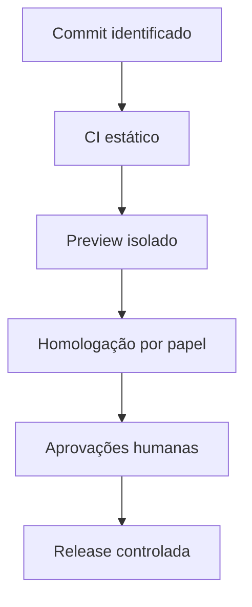

# Harness operacional e gates de release

Status em 3 de agosto de 2026: **PARTIAL — backend homologado; Preview e produção fechadas**

## Objetivo

O harness define como contexto, ferramentas, decisões, segurança, observabilidade e avaliação envolvem o modelo e o restante do sistema. Nenhuma demo visual ou build verde substitui os gates de autorização e integridade fiscal.

## Matriz D/J/H

| Classe             | Responsável                     | Permitido                                       | Exemplos                                             | Evidência mínima                                  |
| ------------------ | ------------------------------- | ----------------------------------------------- | ---------------------------------------------------- | ------------------------------------------------- |
| D — determinístico | código/regra versionada         | executar automaticamente em sandbox/homologação | datas, RBT12, Fator R, deduplicação, bloqueios       | versão, entrada, saída, hash, teste               |
| J — julgamento     | humano competente               | decidir e assinar                               | lançamento, autuação, controvérsia, ciência, exceção | identidade, competência, justificativa, timestamp |
| H — híbrido        | máquina propõe; humano confirma | priorizar e redigir sem efetivar                | classificação assistida, minuta, resposta inédita    | fontes, incerteza, revisor, decisão final         |

Regra de escalada: dúvida jurídica, fonte conflitante, baixa confiança, dado ausente, mudança normativa ou ação externa eleva o fluxo para J/H e bloqueia execução automática.

## Classes de risco

| Risco | Exemplo                                                | Autonomia                             |
| ----- | ------------------------------------------------------ | ------------------------------------- |
| R0    | leitura pública de legislação                          | automática com fonte/versionamento    |
| R1    | leitura interna autorizada                             | automática com RLS e auditoria        |
| R2    | cálculo/rascunho reversível                            | automático, mas revisável e sem envio |
| R3    | ato fiscal, exposição de sigilo ou comunicação externa | humano obrigatório; gate fechado hoje |

## Estado dos gates

| Gate                | Estado     | Motivo/evidência necessária                                                                                                                                            |
| ------------------- | ---------- | ---------------------------------------------------------------------------------------------------------------------------------------------------------------------- |
| fonte versionada    | PASS       | PR #1, [commit `72e9d095`](https://github.com/AlmoreContabilidade/Ia-fiscal/commit/72e9d0950a6ccac80e491ce5c818f11745989d9f), árvore `c97dfe1a`, sem alteração da main |
| build/lint/types    | PASS CI    | [GitHub Actions `30869245879`](https://github.com/AlmoreContabilidade/Ia-fiscal/actions/runs/30869245879) aprovado no commit exato                                     |
| testes unitários    | PASS CI    | 50/50 testes e 12/12 contratos no mesmo snapshot                                                                                                                       |
| banco reproduzível  | PARTIAL    | 36/36 aplicadas e reconciliadas; replay vazio ainda não rodou                                                                                                          |
| RPC/RLS             | PASS SQL   | autorização e fronteira operacional aprovadas pós-aplicação                                                                                                            |
| autenticação E2E    | BLOCKED    | MFA/recuperação implementados; zero usuários reais de teste                                                                                                            |
| Edge/worker         | PASS busca | search v3 aprovada em JWT inválido, AAL1, AAL2 e tenant incorreto                                                                                                      |
| IA supervisionada   | BLOCKED    | claim/leitura conectados; resposta, revisão e publicação E2E faltam                                                                                                    |
| preview Vercel      | BLOCKED    | zero projetos e nenhum canal autenticado com target/env controlados                                                                                                    |
| comunicação externa | CLOSED     | proibida por escopo e por gate jurídico/operacional                                                                                                                    |
| produção            | CLOSED     | replay, E2E, restore, operação e aprovações ainda pendentes                                                                                                            |

O ledger inicial contém 31 itens: 11 PASS, 7 FAIL, 9 BLOCKED e 4 NOT_RUN, com quatro defeitos P1,
dois P2 e um P3. A cópia imutável está em [`qa/ledger-initial.json`](qa/ledger-initial.json). O
ledger atual mantém o inventário incompleto e a ausência de ciclo web crítico de forma explícita.
Consulte [`qa/ledger-current.json`](qa/ledger-current.json) e
[`qa/release-readiness-2026-08-03.md`](qa/release-readiness-2026-08-03.md).

## Baseline reconciliado do Supabase

O histórico remoto contém 36 migrações aplicadas e reconciliadas por checksum. AAL2, contexto
municipal, claim idempotente, fronteiras de lote e publicação fail-closed passaram em duas provas
pré-aplicação e nas regressões pós-aplicação. A evidência está em
[`qa/evidence/supabase-postapply-regression-2026-08-03.json`](qa/evidence/supabase-postapply-regression-2026-08-03.json).

Isso não fecha o gate de reconstrução: o replay completo em banco descartável e a comparação com
`supabase/baseline/catalog-fingerprint.json` continuam obrigatórios.

## Pipeline de evidência

Qualquer falha retorna o release ao estágio anterior. Produção somente existe quando todos os gates críticos estão PASS no mesmo commit e no mesmo baseline de banco.

## Critérios por estágio

### Commit/CI

- lockfile íntegro e instalação com `npm ci`;
- lint, TypeScript, testes e build verdes;
- nenhum segredo administrativo no cliente ou repositório;
- documentação e ADR atualizados quando o contrato muda.

### Preview

- ambiente de preview, nunca domínio de produção;
- somente dados sintéticos ou tenant explicitamente autorizado;
- navegação mobile/tablet/desktop e estados loading/empty/error;
- sem fallback silencioso para mock quando `VITE_DATA_MODE=supabase`;
- cabeçalhos, logs e bundle revisados quanto a segredo/PII.

### Homologação integrada

- matriz de papéis: anônimo, fiscal, contribuinte, contador, worker e mantenedor;
- isolamento entre tenants e entre contribuintes;
- testes negativos das 17 funções privilegiadas mantidas;
- CRUD/transações/idempotência/concorrência onde aplicável;
- Edge Functions com JWT inválido, usuário sem vínculo e escopo cruzado;
- trilha ponta a ponta e correlação de logs;
- IA: resposta conhecida, inédita, rejeitada, fonte vencida e baixa confiança;
- nenhuma entrega externa.

### Produção

- os itens anteriores PASS em duas regressões críticas limpas consecutivas;
- backup e restore comprovados;
- observabilidade, alertas e on-call exercitados;
- documentação LGPD/jurídica aprovada;
- plano de implantação, rollback e janela aprovados;
- sign-off técnico, fiscal, segurança, jurídico e controlador de dados.

## Regras de waiver

- P0/P1 de autorização, sigilo, integridade fiscal, auditabilidade ou dados pessoais não aceitam waiver para produção.
- Bloqueio por ausência de evidência não vira PASS por decisão verbal.
- Waiver permitido deve ter proprietário, justificativa, risco residual, compensação, prazo e aprovador.
- Toda reabertura de gate atualiza o ledger; nunca sobrescrever a evidência inicial.

## Rollback

1. Desabilitar feature flag/rota afetada e congelar novas execuções.
2. Preservar logs, IDs e evidência; não apagar registros fiscais.
3. Reverter aplicação para artefato conhecido sem reescrever histórico.
4. Banco só reverte por migração compensatória revisada e testada; nunca executar os scripts históricos em massa.
5. Validar integridade, RLS e filas antes de reabrir.
6. Registrar causa, impacto e decisão no ledger e post-mortem.
